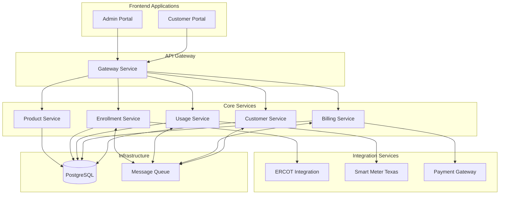

# Architecture Overview

OSSREP follows a microservices architecture pattern, with each service responsible for a specific business domain within the retail electric provider operations.

## High-Level Architecture

## Design Principles

### Domain-Driven Design

Each microservice represents a bounded context aligned with a specific business domain:

- **Customer Context** - Customer accounts, contacts, service locations
- **Billing Context** - Invoices, payments, collections
- **Usage Context** - Meter data, consumption tracking
- **Enrollment Context** - Service requests, switches, move-ins/outs
- **Product Context** - Rate plans, pricing, contracts

### Event-Driven Architecture

Services communicate asynchronously through events for loose coupling:

- `CustomerCreated`, `CustomerUpdated`
- `UsageReceived`, `UsageProcessed`
- `InvoiceGenerated`, `PaymentReceived`
- `EnrollmentSubmitted`, `EnrollmentConfirmed`

### API-First Design

All services expose RESTful APIs following OpenAPI 3.0 specification.

## Repository Structure

| Repository | Description |
|------------|-------------|
| `ossrep.github.io` | Documentation site |
| `customer-service` | Customer management microservice |
| `billing-service` | Billing and invoicing microservice |
| `usage-service` | Usage data processing microservice |
| `enrollment-service` | Enrollment and ERCOT transactions |
| `product-service` | Products and rate plans |
| `gateway-service` | API gateway |
| `customer-portal` | Angular customer-facing application |
| `admin-portal` | Angular internal operations application |
| `ossrep-commons` | Shared libraries and utilities |
